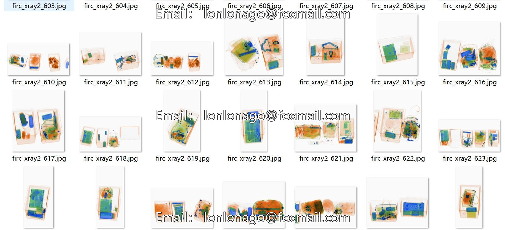
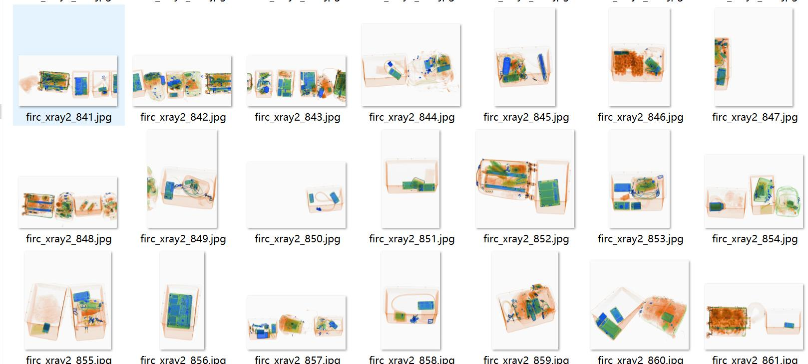
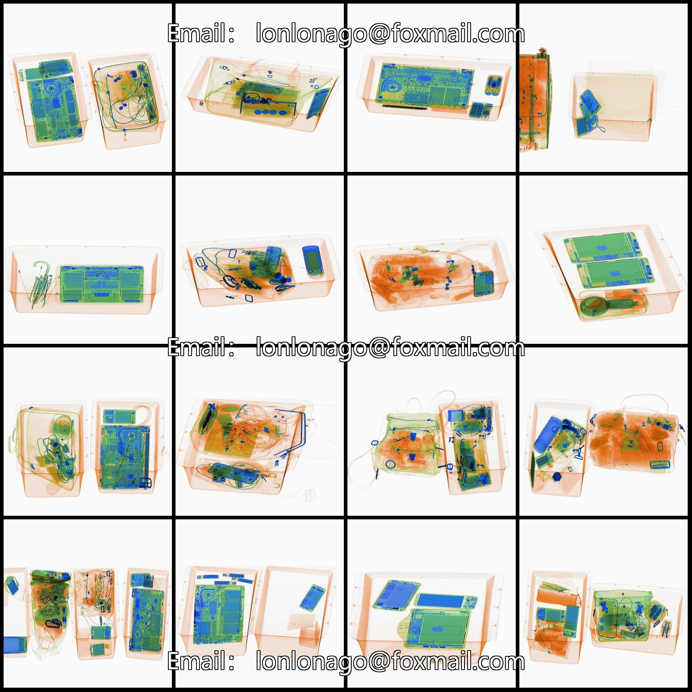
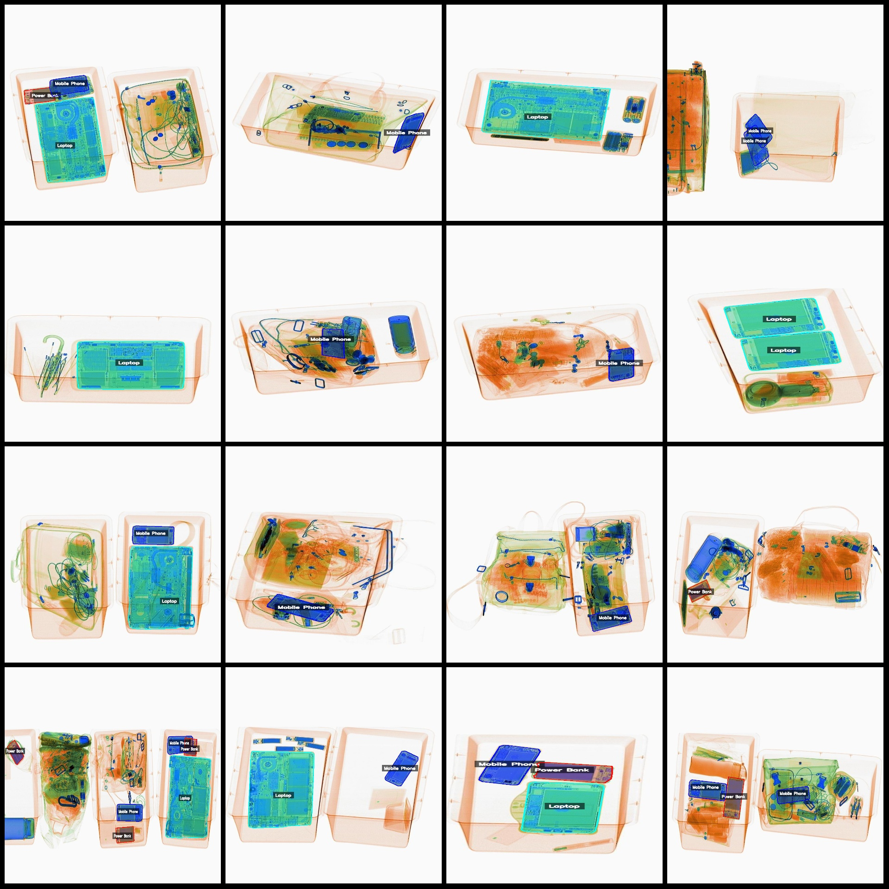
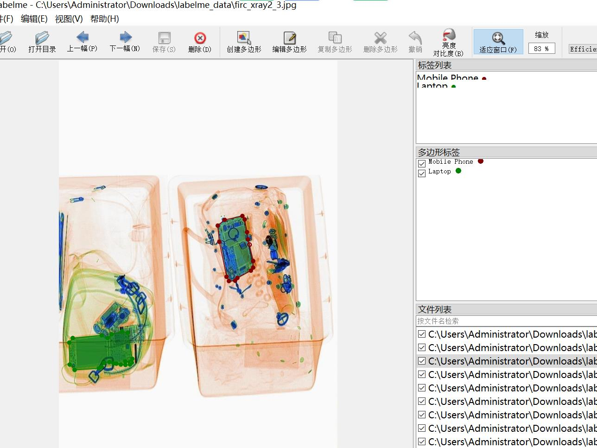

# X-ray Security Target Identification and Segmentation Dataset: LabelMe Format with 2000 Images of 5 Categories

**Dataset Format:** LabelMe format (excluding mask files, only containing JPG images and corresponding JSON files)

**Number of Images (JPG Files):** 2000
**Number of Annotations (JSON Files):** 2000
**Number of Categories:** 5
**Category Names:** ["Electronic Items", "Laptop", "Mobile Phone", "Power Bank", "Tablet"]
**Box Count for Each Category:**
- Electronic Items : count = 54
- Laptop : count = 978
- Mobile Phone : count = 2159
- Power Bank : count = 471
- Tablet : count = 46
**Total Boxes:** 3708
**Annotation Tool:** labelme=5.5.0
**Image Resizing:** Various resolution images, e.g., 940x1040, 780x1040, etc.
**Annotation Rules:** Polygon boxes for categories are drawn.
**Important Notice:** The dataset can be edited using the LabelMe tool, but the JSON dataset must be converted into either a mask or Yolo/COCO format for semantic segmentation or instance segmentation.
**Special Remark:** This dataset does not guarantee the accuracy of the trained models or weight files.
**Image Preview:**
**Example Annotations:**
- **Original Image (randomly selected 16 images):**
- **Annotation Drawing Results:**
- **LabelMe Editing Examples:**
## Images

Here is a pay link on Stripe ( https://buy.stripe.com/3cs8yP7sY87d0vu9AB ). Please contact me lonlonago@foxmail.com after funding $89, and I will send you a complete data files , thank you!

